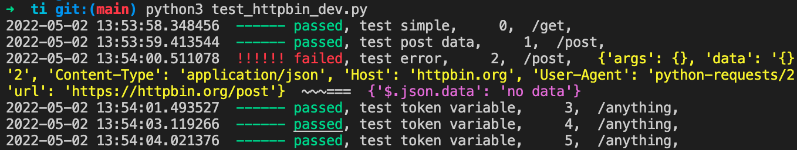
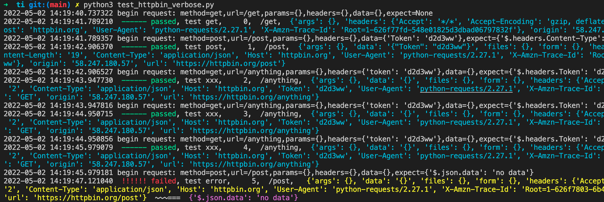

# ti
ti is a simple python auto test framework

## features

* use *expect* to ensure the response as expect
* use *ctx* dict to store variables and response values
* use jsonpath to reference the variable from ctx or response
* can restore response value in *ctx* with another name
* only one single python file, can integrate into your project very convinient

## install dependencies

> pip3 install requests jsonpath

## examples

```python
from ti import T, run

ctx = {}
ctx['host'] = 'https://httpbin.org'

tests = [
    T(name='test simple', url='/get',method='get'),
    T(name='test post data', url='/post',method='post',data={"Token":'d2d3ww'}, expect={'$.headers.Content-Type': 'application/json','$.json.Token':'d2d3ww'},ctx={'login_token':'$.json.Token'},

    T(name='test error', url='/post',method='post', expect={'$.json.data':'no data'}),

    [
        T(name='test token variable', url='/anything',method='get',headers={'token':'$.login_token'},expect={'$.headers.Token':'d2d3ww'}),
    ]*3
]

run(tests, ctx, verbose=False)
```

simple output:



verbose output:

